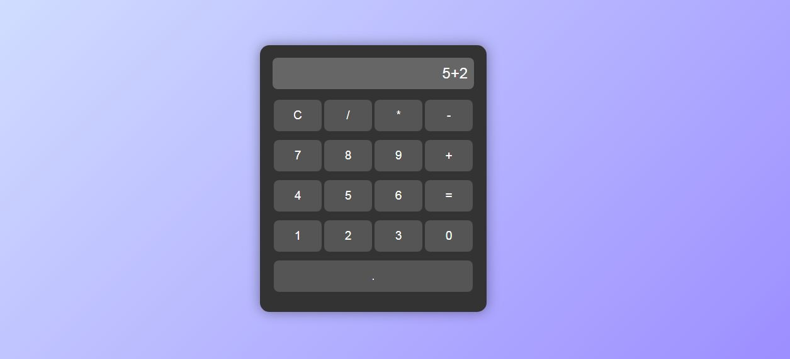

# CodeAlpha Calculator

This is a simple web-based **Calculator App** built as part of the **CodeAlpha Frontend Internship**.

## Features

- Perform basic arithmetic operations: **Addition, Subtraction, Multiplication, Division**
- Interactive **UI with buttons and display screen**
- Real-time result display
- **Clear and delete** functionality
- Fully responsive design using HTML, CSS, and JavaScript

## Technologies Used

- HTML5
- CSS3
- JavaScript

## Screenshot

## Project Status

✔️ Completed — submitted as Task 2 for CodeAlpha Internship

## Folder Structure

- CodeAlpha_Calculator
  
  - index.html → Main structure of the calculator  
  - style.css → CSS for layout and design  
  - script.js → JavaScript logic for calculations

